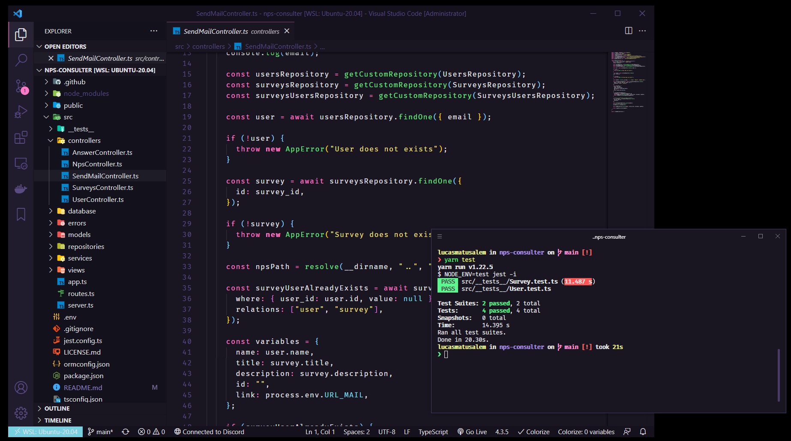

<h1 align="center">NPS-Consulter</h1>

  

## ✨ Tecnologias

Esse projeto foi desenvolvido com as seguintes tecnologias:

- [TypeScript](https://www.typescriptlang.org/)
- [Ethereal-Email](https://ethereal.email/)
- [TypeORM](https://typeorm.io/#/)
- [Express](https://expressjs.com/pt-br/)
- [Jest](https://jestjs.io/)

## 💻 Projeto

O NPS-Consulter é uma aplicação que consiste em calcular o NPS da empresa. Nele fazemos o cadastro de usuários, cadastro de pesquisas, envio de e-mail para os usuários responderem as pesquisas de satisfação e com isso podemos realizar o cálculo do NPS.

## 🔶 Diagrama

## 🚀 Como executar

- Clone o repositório
- Instale as dependências com npm ou yarn
- Inicie o servidor com o script `dev`

A aplicação pode ser acessada em [`localhost:3333`](http://localhost:3333).
